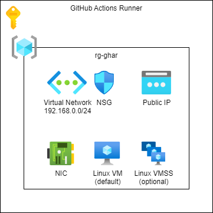

# Terraform - Azure - GitHub Actions Runner

## Table of Contents

* [Introduction](#introduction)
* [Pre-Requirements](#pre-requirements)
* [Azure Infrastructure](#azure-infrastructure)
* [Terraform](#modules)
* [Scripts](#scripts)
* [GitHub Actions](#github-actions)
  * [GitHub Actions Runner - Terraform Apply](#github-actions-runner---terraform-apply)
  * [GitHub Actions Runner - Terraform Destroy](#github-actions-runner---terraform-destroy)

## Introduction

This is a collection of Terraform scripts that show how to create Azure resources.

## Pre-Requirements

* Service Principal
* Remote Backend
* [terraform-azure-setup-remote-backed](https://github.com/gutt02/terraform-azure-setup-remote-backend)

## Azure Infrastructure



## Terraform

### Azure Resources

* Resource Group
* Azure Virtual Network
* Linux Virtual Machine (default)
* Linux Virtual Machine Scale Set ()

### Variables

```hcl
variable "admin_username" {
  type        = string
  sensitive   = true
  description = "Linux Virtual Machine Admin User."
}
```

```hcl
# VirtualMachine or VirtualMachineScaleSet
variable "gh_actions_runner_type" {
  type        = string
  default     = "VirtualMachine"
  description = "Type of the GitHub Runner."
}
```

```hcl
# curl ipinfo.io/ip
variable "client_ip" {
  type = object({
    name             = string
    cidr             = string
    start_ip_address = string
    end_ip_address   = string
  })

  description = "List of client ips, can be empty."
}
```

```hcl
variable "client_secret" {
  type        = string
  sensitive   = true
  description = "Client secret of the service principal."
}
```

```hcl
variable "location" {
  type        = string
  default     = "westeurope"
  description = "Default Azure region, use Azure CLI notation."
}
```

```hcl
variable "project" {
  type = object({
    customer    = string
    name        = string
    environment = string
  })

  default = {
    customer    = "azc"
    name        = "base"
    environment = "vse"
  }

  description = "Project details, like customer name, environment, etc."
}
```

```hcl
variable "linux_virtual_machine" {
  type = object({
    size = string

    source_image_reference = object({
      publisher = string
      offer     = string
      sku       = string
      version   = string
    })
  })

  default = {
    size = "Standard_B2s"
    # size = "Standard_A2_v2"

    source_image_reference = {
      publisher = "Canonical"
      offer     = "UbuntuServer"
      sku       = "18.04-LTS"
      version   = "latest"
    }
  }

  description = "Linux Virtual Machine."
}
```

```hcl
variable "tags" {
  type = object({
    created_by  = string
    contact     = string
    customer    = string
    environment = string
    project     = string
  })

  default = {
    created_by  = "vsp-base-msdn-sp-tf"
    contact     = "contact@me"
    customer    = "Azure Cloud"
    environment = "Visual Studio Enterprise"
    project     = "GitHub Agent"
  }

  description = "Default tags for resources, only applied to resource groups"
}
```

```hcl
variable "virtual_network" {
  type = object({
    address_space = string

    subnets = map(object({
      name          = string
      address_space = string
    }))
  })

  default = {
    address_space = "192.168.0.0/24"

    subnets = {
      virtual_machine = {
        name          = "virtual-machine"
        address_space = "192.168.0.0/28"
      }
    }
  }

  description = "VNET destails."
}
```

## Scripts

### `post_deployment.sh`
  * Updates virtual machine.
  * Installs additional packages.
  * Creates a user gharund for the GitHub Actions Runner service.

### `github_actions_runner.sh`
  * Template to install the GitHub Actions Runner as a service.

## GitHub Actions

### Secrets and variables

| Secret | Description |
| --- | --- |
| CLIENT_ID | Client Id of the service principal |
| CLIENT_SECRET | Client secret of the service principal
| TENANT_ID | Id of the tenant |

| Variable | Description |
| --- | --- |
| ADMIN_USERNAME | Name of the virtual machine admin user. |
| PROJECT_CUSTOMER| Abbreviation of the customer |
| PROJECT_ENVIRONMENT | Abbreviation of the environment |
| PROJECT_NAME | Abbreviation of the project |
| STATE_CONTAINER_NAME | Name of the container in the Storage Account where the state files are stored. |
| STATE_RESOURCE_GROUP_NAME | Name of the resource group of the Storage Account |
| STATE_STORAGE_ACCOUNT_NAME | Name of the Storage Account where the state files are stored. |
| SUBSCRIPTION_ID | Id of the Azure Subscription |
| USER_OBJECT_ID | Id of the user object who gets access to the Key Vault. |

## GitHub Actions Runner - Terraform Apply

Creates the GitHub Actions Runner.

### Script

terraform_apply.yml

### Inputs

| Parameter | Type | Required | Default | Description |
| --- | --- | --- | --- | --- |
| CLIENT_IP | string | true | 127.0.0.1 | Client IP |

## GitHub Actions Runner - Terraform Destroy

Destroys the GitHub Actions Runner.

### Script

terraform_destroys.yml

### Inputs

| Parameter | Type | Required | Default | Description |
| --- | --- | --- | --- | --- |
| CLIENT_IP | string | true | 127.0.0.1 | Client IP |

## Resources

[Adding self-hosted runners](https://docs.github.com/en/actions/hosting-your-own-runners/adding-self-hosted-runners)

[Configuring the self-hosted runner application as a service](https://docs.github.com/en/actions/hosting-your-own-runners/configuring-the-self-hosted-runner-application-as-a-service)

[Variables](https://docs.github.com/en/actions/learn-github-actions/variables)

[Encrypted secrets](https://docs.github.com/en/actions/security-guides/encrypted-secrets)